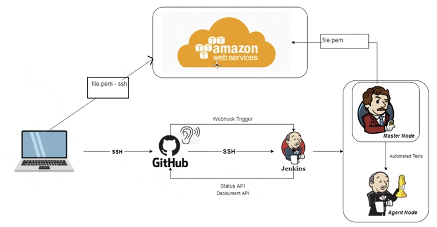

# CICD-with-Jenkins

## What is Jenkins

Jenkins is an open-source automation tool written in Java with plugins built for continuous integration. Jenkins is used to build and test your software projects continuously making it easier for developers to integrate changes to the project, and making it easier for users to obtain a fresh build. It also allows you to continuously deliver your software by integrating with a large number of testing and deployment technologies.

How it works:

- simple way to set up conitnous integration/ continous delivery environment
- environment is set up using multi stage approach i.e. pipelines
- automation of other routine development tasks
- doesnt eliminate need to create scripts for individual steps
- faster way to integrate chain of build, test, and deployment tools

## Other tools like Jenkins

- CircleCI
- Bitrise
- Gitlab
- CloudBees
- Copado CI/CD
- Azure DevOps Server

## Jenkins Stages

Jenkins deployment takes place in multiple stages, at minimum you would have three stages defined as `Build`, `Test` and `Deploy`. Below diagram shows different stages of jenkins:

## Using Jenkins

- To create a build within Jenkins, follow the steps in the guide [here](./jenkins-job.md)

## Adding Webhooks

- To learn how to add webhooks you can visit this [file](./web-hooks.md)

## How to create jenkins project to merge branches

- To learn how to create a jenkins project that will merge branches before build, follow this guide [here](./ci-merge.md)

## How to deploy code from main branch to production (ec2) with Jenkins

- After some code has been pushed to a specific branch in git, following the concepts of continous integration, continous delivery and continous deployment, we can send this code to production in AWS once all tests have been passed. To do this using Jenkins, you can follow the guide [here](./cicd-production.md)
