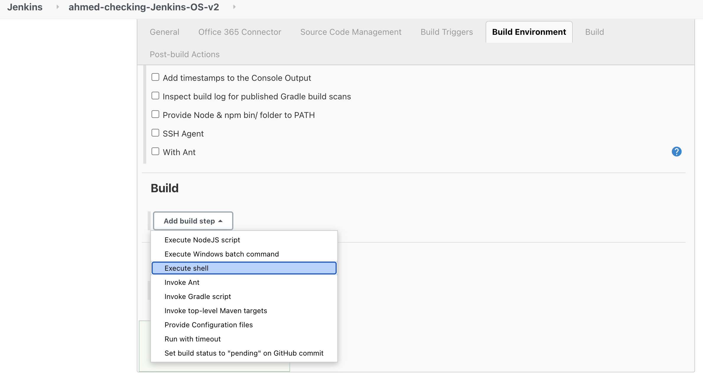
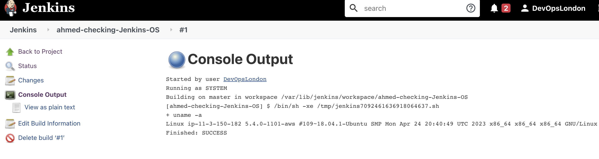

# CICD-with-Jenkins

## What is Jenkins

Jenkins is an open-source automation tool written in Java with plugins built for continuous integration. Jenkins is used to build and test your software projects continuously making it easier for developers to integrate changes to the project, and making it easier for users to obtain a fresh build. It also allows you to continuously deliver your software by integrating with a large number of testing and deployment technologies.

How it works:

- simple way to set up conitnous integration/ continous delivery environment
- environment is set up using multi stage approach i.e. pipelines
- automation of other routine development tasks
- doesnt eliminate need to create scripts for individual steps
- faster way to integrate chain of build, test, and deployment tools


## Other tools like Jenkins

- CircleCI
- Bitrise
- Gitlab
- CloudBees
- Copado CI/CD
- Azure DevOps Server

## Using Jenkins

To create a build within Jenkins, follow the steps below:

1. You can enter your IP address from AWS with port `8080` as that's default for jenkins. It would look something like this:

```
3.9.13.91:8080
```

2. Select `New Item` and name your build appropriately i.e. `ahmed-checking-Jenkins-OS`. As our task is simple we would choose the type of project as `Freestyle Project` as it looks in this screenshot:


3. Provide a brief description in the `General` tab and move forward to the `Build` part. We're only running a shell command for our demo so you should select `excute shell` option as follows:



4. Click `save` and `apply`

5. You should be able to view your project in the dashboard and select it and once selected see options as shown below:


6. Click on `Build now` as shown above and from the build history shown under the menu on the left you can choose `console output` to view the output of the command you added in your project.


Output should look like this:



## Adding Webhooks

To learn how to add webhooks you can visit this [file](./web-hooks.md)
