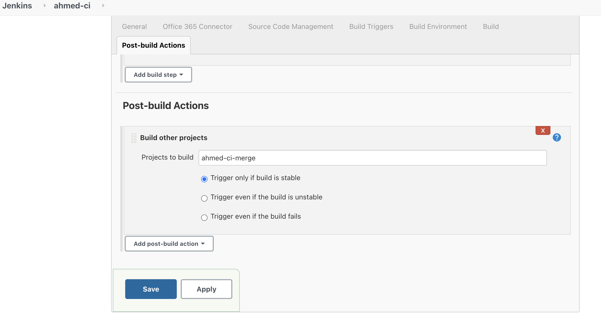

# How to create Jenkins jobs to merge git branches

In Jenkins, create a new job titled `ahmed-ci-merge`, you can use the guide [here](./README.md)

Additional steps are below:

1. We will need to configure the `source code management` section for this task, after integrating your github repo, you'll need to change the `branches to build` to `dev. NOTE: add your repo name as `origin`.
2. Select `Merge before build` in `Additonal behaviour` and add `main` as your branch to merge to. It should look like this:

3. Go to the first job created i.e. `ahmed-ci` and add `Build other Projects` from `Post build Actions` dropdown. Add your `ahmed-ci-merge` project to this and select `Trigger only if build is stable` option.

