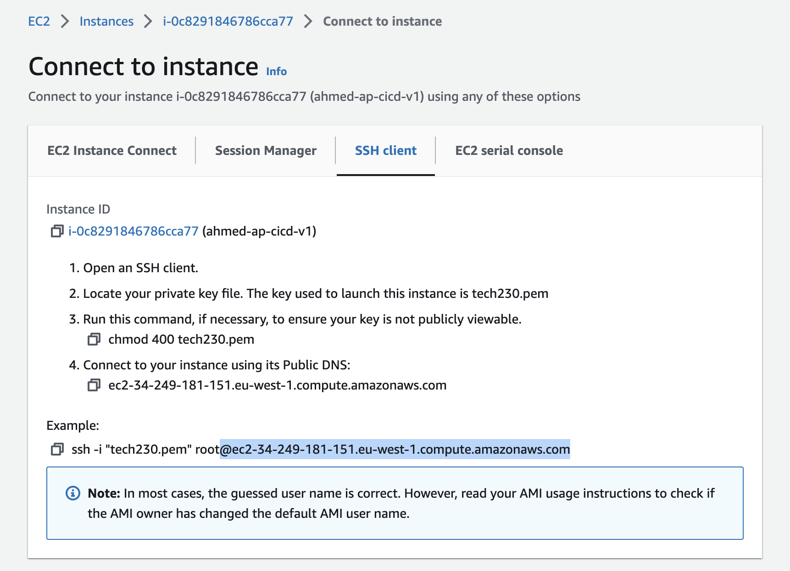
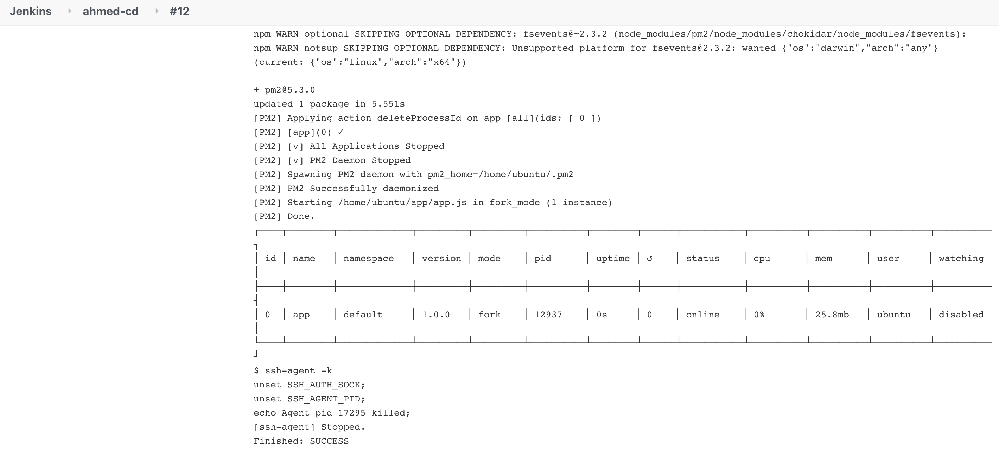

# How to push your code from main branch to production (ec2)

Prerequisites:

- You need to have an ec2 instance from App AMI running for this task.
- Jenkins jobs setup for continous integration from github, run all tests and merge branches with main with every change.

### In Jenkins

1. Create new Jenkins project, you can follow the guide [here](./README.md), you'll need to match your configuration as below:

- In General, Select `Discard old builds` and add max number of builds to keep. Also, select your project as a `Github project` and paste the HTTP Url in the field provided.

- In Office 365 connector, select `Restrict where this project can be run` and add `sparta-ubuntu-node` to it.

- In `Source Code Management`, add `ssh` link to the github repo in `Repository URL` and add the branch as `main` as upstream job would have merged all changes from `dev` to `main`. Select `branches to build` as `main` as all branches should be up do date.

It should look like this:


- Ignore `build triggers` because this job will be run automatically if our `ahmed-ci-merge` build is stable. (`ahmed-cd` is included in post build actions of `ahmed-ci-merge`).

- In `Build Environment`, add `SSH Agent` and `tech230.pem` key that has already been added.

- In Build, add the following shell script to be executed:

NOTE: You will need to obtain the highlighted IP from your ec2 and replace in the following code so SSH connection can be established, the IP address required is highlighted in the screenshot below.

```
rsync -avz -e "ssh -o StrictHostKeyChecking=no" app ubuntu@ec2-34-249-181-151.eu-west-1.compute.amazonaws.com:/home/ubuntu
ssh -o "StrictHostKeyChecking=no" ubuntu@ec2-34-249-181-151.eu-west-1.compute.amazonaws.com <<EOF
sudo bash ./app/provision.sh
cd app
pm2 kill
pm2 start app.js
EOF
```



2. Now that all the jobs have been setup, you can make a change to the app page in index.esj file within the app folder. for the purpose of this demo, we have changed the text `This app is running correctly` to `This app is running correctly thanks to ahmed`.

3. Once all your builds have finished, your `console output` for the last build should show the app as `online`. see below:



4. Now obtain the public IP from ec2 instance as it appears here:


5. Paste the IP just copied into browser with `port 3000` added to the end and you should see the following output:


