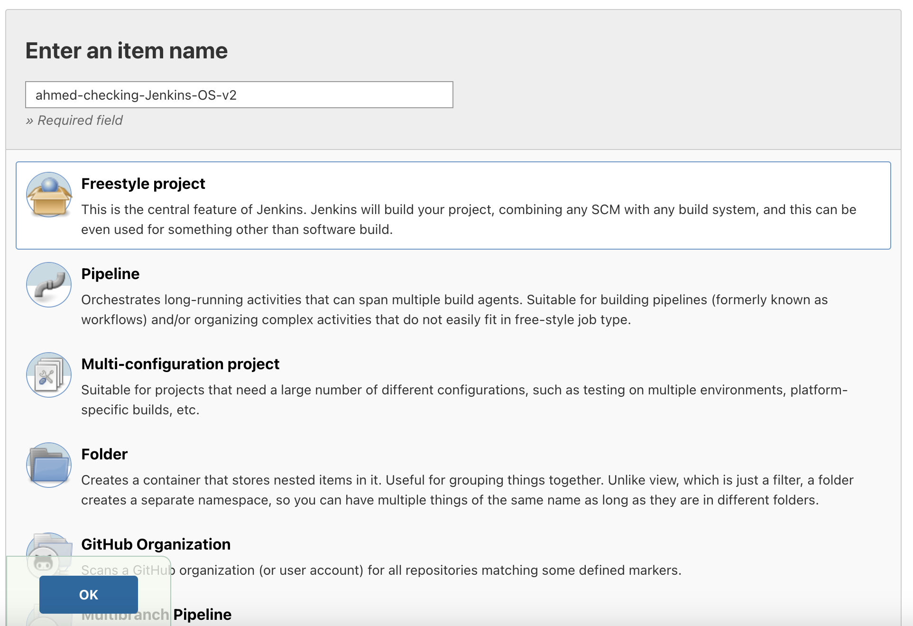
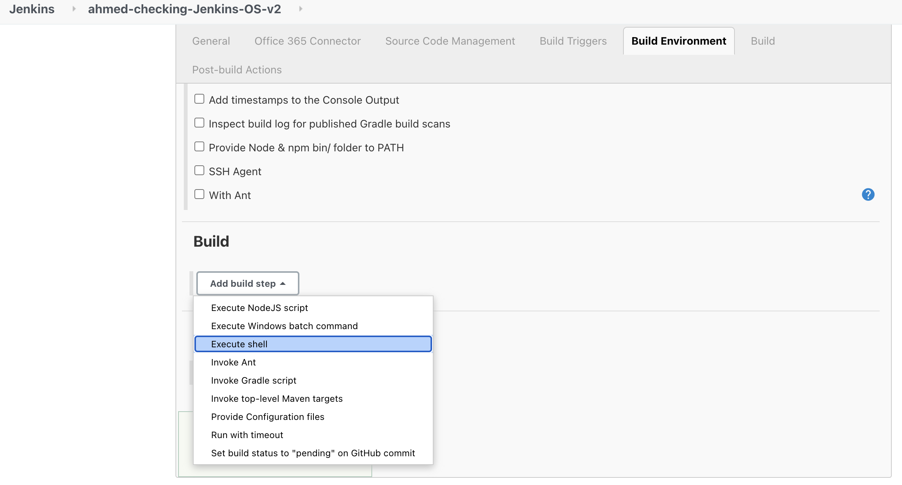
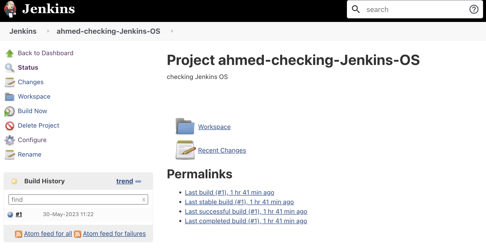
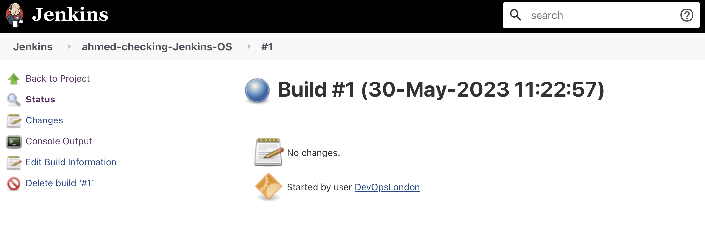
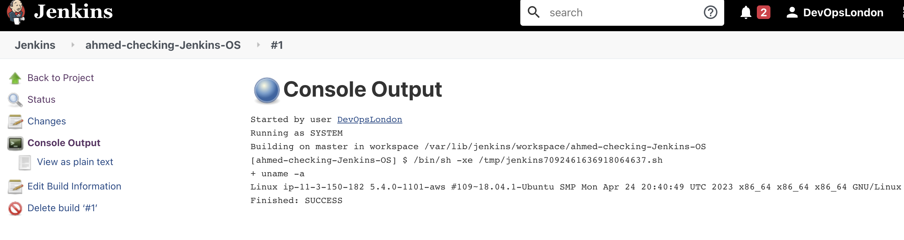

## Using Jenkins

To create a build within Jenkins, follow the steps below:

1. You can enter your IP address from AWS with port `8080` as that's default for jenkins. It would look something like this:

```
3.9.13.91:8080
```

2. Select `New Item` and name your build appropriately i.e. `ahmed-checking-Jenkins-OS`. As our task is simple we would choose the type of project as `Freestyle Project` as it looks in this screenshot:



3. Provide a brief description in the `General` tab and move forward to the `Build` part. We're only running a shell command for our demo so you should select `excute shell` option as follows:



4. Click `save` and `apply`

5. You should be able to view your project in the dashboard and select it and once selected see options as shown below:



6. Click on `Build now` as shown above and from the build history shown under the menu on the left you can choose `console output` to view the output of the command you added in your project.



Output should look like this:


