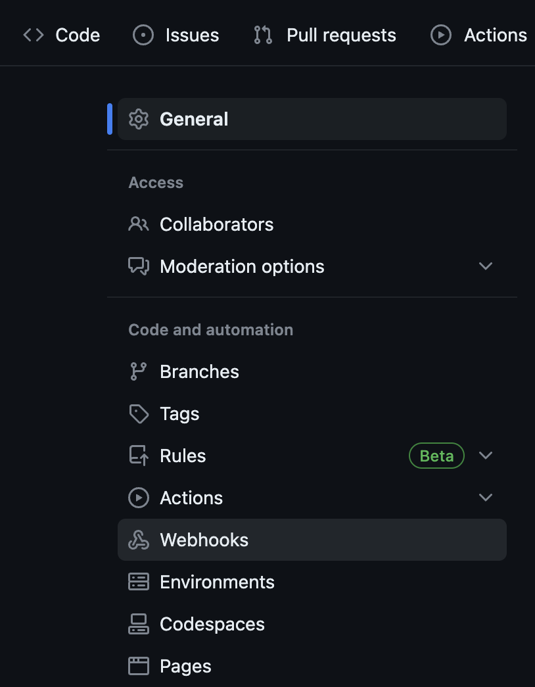
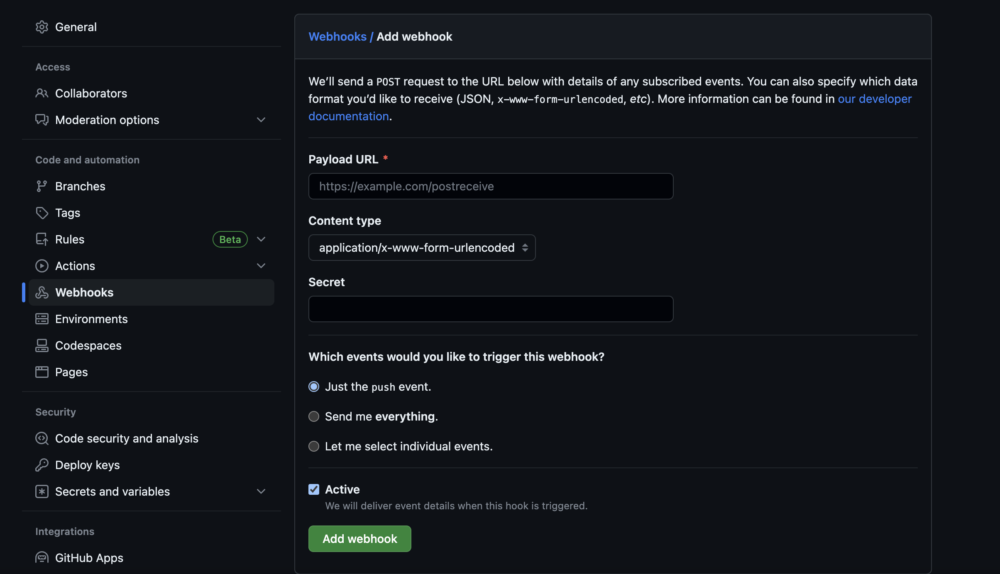

# How to add a webhook to github & jenkins

In order to integrate our github & jenkins we can follow the steps below. The reason behind the need for this integration is to follow conitnous integration so essentially whenever our github repo receives changes (through `push` or `pull` requests), jenkins receives a webhook trigger to run the relevant job again.

1. In your github repo, select `settings` and `webhooks` from the menu on the left.

2. Click on `add webhook` option presented in this section and you should see a screen that looks like below. In `payload URl` enter the job URL from jenkins and add `/github-webhook/` at the end. For 'Which events would you like to trigger this webhook?' you should select `Let me select individual events` and select `push` and `pull` as below

